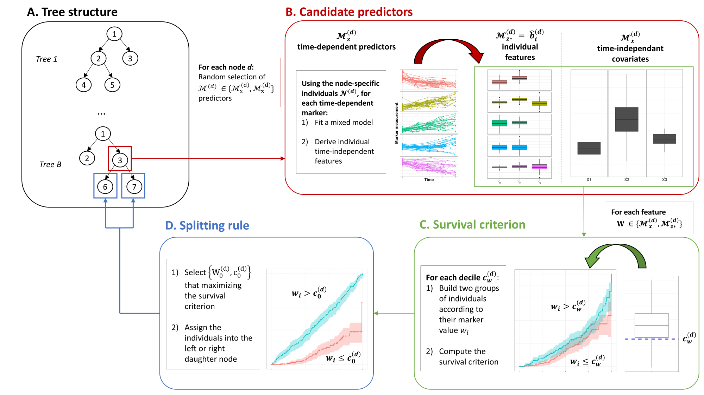

```{r, include = FALSE}
knitr::opts_chunk$set(
  collapse = TRUE,
  comment = "#>",
  eval = FALSE
)
```

`DynForest` methodology is a random forest methodology which can include both time-fixed predictors of any nature and time-dependent predictors possibly measured at irregular times. The purpose of `DynForest` is to predict an outcome which can be categorical, continuous or survival (with possibly competing events).

The random forest should be first build on a learning dataset of $N$ subjects including: $Y$ the outcome; $\mathcal{M}_x$ an ensemble of $P$ time-fixed predictors; $\mathcal{M}_y$ an ensemble of $Q$ time-dependent predictors. Through the random forest, an ensemble of $B$ trees are grown as detailed below.

## The tree building

For each tree $b$ $(b = 1, ..., B)$, we aim to partition the subjects into groups that are homogeneous regarding the outcome $Y$. The tree building process is summarized in figure 1. 

We first draw a bootstrap sample from the original dataset of $N$ subjects. The subjects excluded by the bootstrap constitute the out-of-bag (OOB) sample, noted $OOB^b$ for the tree $b$. Then, at each node $d \in \mathcal{D}$, we recursively repeat the following steps using the $N^{(d)}$ subjects located at node $d$:

1. An ensemble of $\mathcal{M}^{(d)}=\{\mathcal{M}_x^{(d)},\mathcal{M}_y^{(d)}\}$ candidate predictors are randomly selected among $\{\mathcal{M}_x,\mathcal{M}_y\}$ (see figure 1B). The size of $\mathcal{M}^{(d)}$ is defined by the hyperparameter $mtry$;
2. For each longitudinal predictor in $\mathcal{M}_y^{(d)}$:
    1. We independently model the trajectory using a flexible linear mixed model [@laird_random_effects_1982] according to time (specified by the user)
    2. We derive an ensemble $\mathcal{M}_{y\star}^{(d)}$ of individual time-independent features. These features are the individual random-effects $\widehat{b}_i^{(d)}$ of the linear mixed model predicted from the repeated data for individual $i$
    3. We define $\mathcal{M}_\star^{(d)}=\{\mathcal{M}_x^{(d)},\mathcal{M}_{y \star}^{(d)}\}$ our new ensemble of candidate features

3. For each candidate feature $W \in \mathcal{M}_\star^{(d)}$:
    1. We build a series of splits $c_W^{(d)}$ according to the feature values if continuous, or modalities otherwise (see figure 1C), leading to two groups.
    2. We quantify the distance between the two groups according to the nature of $Y$:
        * With $Y$ continuous, we compute the weighted within-group variance with the proportion of subjects in each group as weights 
        * With $Y$ categorical, we compute the weighted within-group Shannon entropy [@shannon_mathematical_1948] (i.e. the amount of uncertainty) with the proportion of subjects in each group as weights 
        * With $Y$ survival \underline{without} competing events, we compute the log-rank statistic test [@peto_asymptotically_1972]
        * With $Y$ survival \underline{with} competing events, we compute the Fine \& Gray statistic test [@gray_class_1988]

4. We split the subjects into the two groups that minimize (for continuous and categorical outcome) or maximize (for survival outcome) the distance defined previously. We denote $\{W_0^d,c_0^d\}$ the optimal couple used to split the subjects where they are assigned to the left and right daughter nodes $2d$ and $2d + 1$, respectively (see figure 1D and A).

To end the recursive procedure described previously, a stopping criterion should be met. We define two stopping criteria: `nodesize` the minimal number of subjects in the nodes and `minsplit` the minimal number of events required to split the node. `minsplit` is only defined with survival outcome. In the following, we call leaves the nodes that cannot be split.

In each leaf $h \in \mathcal{H}$, a summary $\pi^{h^b}$ is computed using the individual belonging to the leaf $h$. The leaf summary is defined according to the outcome. We return:

* the mean, with $Y$ continuous
* the modality with the highest probability, with $Y$ categorical
* the cumulative incidence function over time estimated by Nelson-Aalen [@nelson_hazard_1969; @aalen_nonparametric_1976], with $Y$ survival \underline{without} competing events
* the cumulative incidence function over time estimated by Aalen-Johansen [@aalen_empirical_1978], with $Y$ survival \underline{with} competing events

```{r, fig.cap = "Figure 1: Overall scheme of the tree building in `DynForest` with (A) the tree structure, (B) the node-specific treatment of time-dependent predictors to obtain time-fixed features, (C) the dichotomization of the time-fixed features, (D) the splitting rule.", eval = TRUE, echo = FALSE, out.width="90%"}

```

## Individual prediction of the outcome

### Out-Of-Bag individual prediction

For a subject $\star$, its individual prediction on a single tree $\hat{\pi}^{h_\star^b}$ is obtained by dropping down the subject along the tree. At each node $d$, the subject $\star$ is assigned to the left or right node according to its data and the optimal couple $\{W_0^d,c_0^d\}$. Random-effects for $\star$ are predicted from the individual repeated measures using the estimated parameters from the linear mixed model if $W_0^d$ is a random-effect feature.

The overall OOB prediction $\hat{\pi}_{ \star}$ can be computed by averaging the tree-based prediction over the random forest as follows:
\begin{equation}
  \hat{\pi}_{ \star} = \frac{1}{|\mathcal{O}_\star|} \sum_{b \in \mathcal{O}_\star} \hat{\pi}^{h_\star^b}
\end{equation}
where $\mathcal{O}_\star$ is the ensemble of trees where $\star$ is $OOB$ and $|\mathcal{O}_\star|$ denotes its length.

### Individual dynamic prediction from a landmark time

With a survival outcome, the OOB prediction described in the previous paragraph can be extended to compute dynamic prediction at landmark $s$ where the longitudinal data are collected until this time. For a new subject $\star$, we thus define the individual prediction $\hat{\pi}_{\star}(s)$ at landmark time $s$ with:
\begin{equation}
  \hat{\pi}_{\star}(s) = \frac{1}{B} \sum_{b=1}^B \hat{\pi}^{h_\star^b}(s)
\end{equation}
where $\hat{\pi}^{h_\star^b}(s)$ is the tree-based prediction computed by dropping down $\star$ along the tree by considering longitudinal predictors collected until $s$ and time-fixed predictors.

## Out-Of-Bag prediction error

Using the OOB individual predictions, an OOB prediction error can be internally assessed, in particular to tune the hyperparameters of the random forest. The OOB prediction error estimates the difference between observed and predicted values and is defined according to the nature $Y$ by:

* the mean square error (MSE), with $Y$ continuous
* the missclassification error, with $Y$ categorical
* the Integrated Brier Score (IBS) [@sene_individualized_2016], with $Y$ survival

We want to minimize as much as possible the OOB prediction error by tuning `mtry`, `nodesize` and `minsplit` hyperparameters.

## Explore the most predictive variables

### Variable importance

The variable importance (VIMP) measures the loss of OOB error of prediction [@ishwaran_random_2008] when removing the link between a predictor and the outcome by using permutation of the predictor values at the subject level (for time-fixed predictors) or at observation level (for time-dependent predictors). In other words, large VIMP value indicates good prediction ability for the predictor. 

However, the possible correlation between the predictors may lead to incorrect VIMP statistic [@gregorutti_correlation_2017]. The grouped variable importance (gVIMP) can be computed on a group of correlated predictors (defined by the user) in the same fashion as the VIMP statistic, except the permutation is performed simultaneously on all the predictors of the group. Large gVIMP value indicates good prediction ability for the group of predictors.

### Minimal depth

The minimal depth is another statistic to quantify the distance between the root node and the first node for which the predictor is used to split the subjects (1 for first level, 2 for second level, 3 for third level, ...). This statistic can be computed at the predictor level or at the feature level, allowing to fully understand the tree building process.

We strongly advice to compute the minimal depth with `mtry` hyperparameter chosen at its maximum to ensure that all predictors are systematically among candidate predictors for splitting the subjects.

## References
