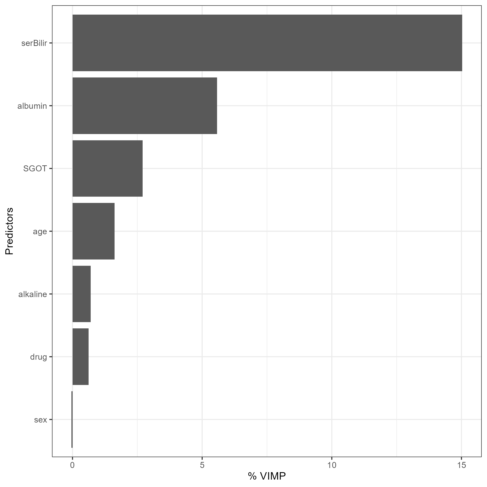
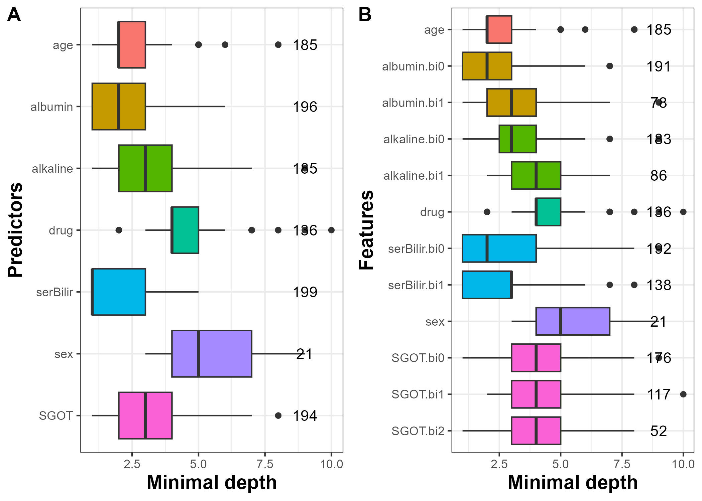

```{r setup, include = FALSE}
knitr::opts_chunk$set(
  collapse = TRUE,
  comment = "#>"
)
```

## Illustrative dataset: `pbc2` dataset

The `pbc2` dataset [@murtaugh_primary_1994] is loaded with the package `DynForest` to illustrate its function abilities. `pbc2` data come from a clinical trial conducted by the Mayo Clinic between 1974 and 1984 to treat the primary biliary cholangitis (PBC), a chronic liver disease. 312 patients were enrolled in a clinical trial to evaluate the effectiveness of D-penicillamine compared to a placebo to treat the PBC and were followed since the clinical trial ends, leading to a total of 1945 observations. During the follow-up, several clinical continuous markers were collected over time such as: the level of serum bilirubin (`serBilir`), the level of serum cholesterol (`serChol`), the level of albumin (`albumin`), the level of alkaline (`alkaline`), the level of aspartate aminotransferase (`SGOT`), platelets count (`platelets`) and the prothrombin time (`prothrombin`). 4 non-continuous time-dependent predictors were also collected: the presence of ascites (`ascites`), the presence of hepatomegaly (`hepatomegaly`), the presence of blood vessel malformations in the skin (`spiders`) and the edema levels (`edema`). These time-dependent predictors were recorded according to `time` variable. In addition to these time-dependent predictors, few predictors were collected at enrollment: the sex (`sex`), the age (`age`) and the drug treatment (`drug`). During the follow-up, 140 patients died before transplantation, 29 patients were transplanted and 143 patients were censored alive (`event`). The time of first event (censored alive or any event) was considered as the event time (`years`)

```{r, message = FALSE}
library("DynForest")
data(pbc2)
head(pbc2)
```

## Data management

For the illustration, we select patients still at risk at 4 years and we recode the `event` variable with `event` = 1 for subjects who died during between 4 years and 10 years, whereas subjects with transplantation were recoded `event` = 0, as the subjects still alive. We split the subjects into two datasets: (i) one dataset to train the random forest using $2/3$ of patients; (ii) one dataset to predict on the other $1/3$ of patients.

```{r, message = FALSE}
pbc2 <- pbc2[which(pbc2$years>4&pbc2$time<=4),]
pbc2$event <- ifelse(pbc2$event==2, 1, 0)
pbc2$event[which(pbc2$years>10)] <- 0
set.seed(1234)
id <- unique(pbc2$id)
id_sample <- sample(id, length(id)*2/3)
id_row <- which(pbc2$id%in%id_sample)
pbc2_train <- pbc2[id_row,]
pbc2_pred <- pbc2[-id_row,]
```

We use the same strategy as in the survival context (section 4) to build the random forest, with the same predictors and the same association for time-dependent predictors.

```{r, eval = FALSE, echo = TRUE}
timeData_train <- pbc2_train[,c("id","time",
                                "serBilir","SGOT",
                                "albumin","alkaline")]
timeVarModel <- list(serBilir = list(fixed = serBilir ~ time,
                                     random = ~ time),
                     SGOT = list(fixed = SGOT ~ time + I(time^2),
                                 random = ~ time + I(time^2)),
                     albumin = list(fixed = albumin ~ time,
                                    random = ~ time),
                     alkaline = list(fixed = alkaline ~ time,
                                     random = ~ time))
fixedData_train <- unique(pbc2_train[,c("id","age","drug","sex")])
```

With a categorical outcome, the definition of the output object is slightly different. We should specify `type`="factor" to define the outcome as categorical, and the dataframe in `Y` should contain only 2 columns, the variable identifier `id` and the outcome `event`.

```{r, eval = FALSE, echo = TRUE}
Y <- list(type = "factor",
          Y = unique(pbc2_train[,c("id","event")]))
```

## The random forest building

We executed `dynforest()` function to build the random forest with hyperparameters `mtry` = 7 and `nodesize` = 2 as follows:
  
```{r, eval = FALSE, echo = TRUE}
res_dyn <- dynforest(timeData = timeData_train, 
                     fixedData = fixedData_train,
                     timeVar = "time", idVar = "id", 
                     timeVarModel = timeVarModel,
                     mtry = 7, nodesize = 2, 
                     Y = Y, ncores = 7, seed = 1234)
```

## Out-Of-Bag error

With a categorical outcome, the OOB prediction error is evaluated using a missclassification criterion. This criterion can be computed with `compute_ooberror()` function and the results of the random forest can be displayed using `summary()`: 

```{r, eval = FALSE, echo = TRUE}
res_dyn_OOB <- compute_ooberror(dynforest_obj = res_dyn)
```

```{r, eval = FALSE, echo = TRUE}
summary(res_dyn_OOB)

dynforest executed for categorical outcome 
	Splitting rule: Minimize weighted within-group Shannon entropy 
	Out-of-bag error type: Missclassification 
	Leaf statistic: Majority vote 
---------------- 
Input 
	Number of subjects: 150 
	Longitudinal: 4 predictor(s) 
	Numeric: 1 predictor(s) 
	Factor: 2 predictor(s) 
---------------- 
Tuning parameters 
	mtry: 7 
	nodesize: 2 
	ntree: 200 
---------------- 
---------------- 
dynforest summary 
	Average depth per tree: 5.89 
	Average number of leaves per tree: 16.81 
	Average number of subjects per leaf: 5.72 
---------------- 
Out-of-bag error based on Missclassification 
	Out-of-bag error: 0.2333 
---------------- 
Computation time 
	Number of cores used: 7 
	Time difference of 2.87888 mins
---------------- 
```

In this illustration, we built the random forest using 150 subjects because we only kept the subjects still at risk at landmark time at 4 years and split the dataset in $2/3$ for training and $1/3$ for testing. We have on average 5.7 subjects per leaf, and the average depth level per tree is 5.9. This random forest predicted the wrong outcome for 24\% of the subjects. The random forest performances can be optimized by choosing the `mtry` and `nodesize` hyperparameters that minimized the OOB missclassification.

## Prediction of the outcome

We can predict the probability of death between 4 and 10 years on subjects still at risk at landmark time at 4 years. In classification mode, the predictions are performed using the majority vote. The prediction over the trees is thus a category of the outcome along with the proportion of the trees that lead to this category. Predictions are computed using `predict()` function, then a dataframe can be easily built from the returning object to get the prediction and probability of the outcome for each subject:
  
```{r, eval = FALSE, echo = TRUE}
timeData_pred <- pbc2_pred[,c("id","time",
                              "serBilir","SGOT",
                              "albumin","alkaline")]
fixedData_pred <- unique(pbc2_pred[,c("id","age","drug","sex")])
pred_dyn <- predict(object = res_dyn,
                    timeData = timeData_pred, 
                    fixedData = fixedData_pred,
                    idVar = "id", timeVar = "time",
                    t0 = 4)
```

```{r, eval = FALSE, echo = TRUE}
head(data.frame(pred = pred_dyn$pred_indiv, 
                proba = pred_dyn$pred_indiv_proba))

    pred proba
101    0 0.945
104    0 0.790
106    1 0.600
108    0 0.945
112    1 0.575
114    0 0.650
```

As shown in this example, some predictions are made with varying confidence from 57.5\% for subject 112 to 94.5\% for subject 101. We predict for instance no event for subject 101 with a probability of 94.5\% and an event for subject 106 with a probability of 60.0\%.

## Predictiveness variables

### Variable importance

The most predictive variables can be identified using `compute_vimp()` and displayed using `plot()` function as follows:
  
```{r, eval = FALSE, echo = TRUE}
res_dyn_VIMP <- compute_vimp(dynforest_obj = res_dyn_OOB, seed = 123)
plot(res_dyn_VIMP, PCT = TRUE)
```

```{r, fig.cap = "Figure 1: VIMP statistic displayed as a percentage of loss in OOB error of prediction.", eval = TRUE, echo = FALSE, out.width="70%"}

```

Again, we found that the most predictive variable is `serBilir`. When perturbating `serBilir`, the OOB prediction error was increased by 15\%.

### Minimal depth

The minimal depth is computed using `compute_vardepth()` function and is displayed at predictor and feature levels using `plot()` function. The results are displayed in Figure 2 using the random forest with maximal `mtry` hyperparameter value (i.e., `mtry` = 7) for a better understanding.

```{r, eval = FALSE, echo = TRUE, fig.show='hide'}
depth_dyn <- compute_vardepth(dynforest_obj = res_dyn_OOB)
p1 <- plot(depth_dyn, plot_level = "predictor")
p2 <- plot(depth_dyn, plot_level = "feature")
```

```{r, eval = FALSE, echo = TRUE}
plot_grid(p1, p2, labels = c("A", "B"))
```

```{r DynForestRfactormindepth, fig.cap = "Figure 2: Average minimal depth by predictor (A) and feature (B).", eval = TRUE, echo = FALSE, out.width="70%"}

```

We observe that `serBilir` and `albumin` have the lowest minimal depth and are used to split the subjects in almost all the trees (199 and 196 out of 200 trees, respectively) (Figure 2A). Figure 2B provides further results. In particular, this graph shows that the random intercept (indicated by bi0) of `serBilir` and `albumin` are the earliest predictors used to split the subjects and are present in 193 and 190 out of 200 trees, respectively.

## References
