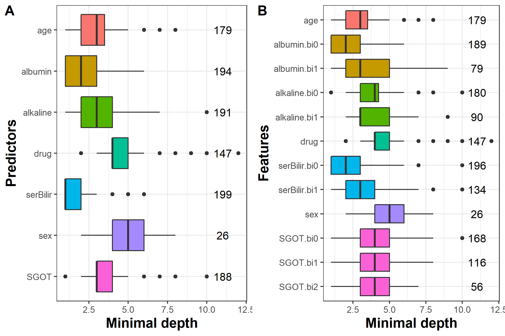

```{r, include = FALSE}
knitr::opts_chunk$set(
  collapse = TRUE,
  comment = "#>",
  eval = FALSE
)
```

## Introduction to `pbc2` dataset

We use `DynForest` on the `pbc2` dataset [@murtaugh_primary_1994] to illustrate our methodology. Data come from the clinical trial conducted by the Mayo Clinic between 1974 and 1984. For the illustration, we consider a subsample of the original dataset resulting to 312 patients and 7 predictors. Among these predictors, the level of serum bilirubin (serBilir), aspartate aminotransferase (SGOT), albumin and alkaline were measured at inclusion and during the follow-up leading to a total of 1945 observations. Sex, age and the drug treatment were collected at the enrollment. During the follow-up, 140 patients died before transplantation, 29 patients were transplanted and 143 patients were alive. The time of first event (alive or any event) was considered as the event time. We aim to predict in this illustration the death without transplantation on patients suffering from primary billiary cholangitis (PBC) using clinical and socio-demographic predictors, considering the transplantation as a competing event.

## Managing data 

For the illustration, we select patients still at risk at 4 years and we recode the `event` variable with `event` = 1 for subjects died during between 4 years and 10 years, `event` = 0 otherwise. We split the subjects into two datasets: (i) one dataset to train the random forest using $2/3$ of patients; (ii) one dataset to predict on the other $1/3$ of patients.

```{r, eval = FALSE, echo = TRUE}
library("DynForest")
pbc2 <- pbc2[which(pbc2$years>4&pbc2$time<=4),]
pbc2$event <- ifelse(pbc2$event==2, 1, 0)
pbc2$event[which(pbc2$years>10)] <- 0
set.seed(1234)
id <- unique(pbc2$id)
id_sample <- sample(id, length(id)*2/3)
id_row <- which(pbc2$id%in%id_sample)
pbc2_train <- pbc2[id_row,]
pbc2_pred <- pbc2[-id_row,]
```

Then, we build the dataframe in the longitudinal format (i.e. one observation per row) for the longitudinal predictors including: `id` the unique patient identifier; `time` the observed time measurements; `serBilir`, `SGOT`, `albumin` and `alkaline` the longitudinal predictors. We also build the dataframe with the time-fixed predictors including: `id` the unique patient identifier; `age`, `drug` and `sex` predictors measured at enrollment. The nature of each predictor needs to be properly defined with `as.factor()` function for categorical predictors (e.g. `drug` and `sex`).

```{r, eval = FALSE, echo = TRUE}
timeData_train <- pbc2_train[,c("id","time",
                                "serBilir","SGOT",
                                "albumin","alkaline")]
fixedData_train <- unique(pbc2_train[,c("id","age","drug","sex")])
```

The first step aims to build the random forest using the `DynForest()` function. We need to specify the mixed model of each longitudinal predictor through a list containing the fixed and random formula for the fixed effect and random effects of the mixed models, respectively. To allow for a flexible trajectory over time, splines can be used in formula using `splines` package. 

```{r, eval = FALSE, echo = TRUE}
timeVarModel <- list(serBilir = list(fixed = serBilir ~ time,
                                     random = ~ time),
                     SGOT = list(fixed = SGOT ~ time + I(time^2),
                                 random = ~ time + I(time^2)),
                     albumin = list(fixed = albumin ~ time,
                                    random = ~ time),
                     alkaline = list(fixed = alkaline ~ time,
                                     random = ~ time))
```

Here, we assume a linear trajectory for `serBilir`, `albumin` and `alkaline`, and quadratic trajectory for `SGOT.` 

Using categorical outcome, we should specify `type`="factor" and the dataframe in `Y` should contain only 2 columns, the variable identifier `id` and the outcome `death`.

```{r, eval = FALSE, echo = TRUE}
Y <- list(type = "factor",
          Y = unique(pbc2_train[,c("id","event")]))
```

## Build the random forest

We executed `DynForest()` function to build the random forest with hyperparameters `mtry` = 7 and `nodesize` = 2 as follows:
  
```{r, eval = FALSE, echo = TRUE}
res_dyn <- DynForest(timeData = timeData_train, 
                     fixedData = fixedData_train,
                     timeVar = "time", idVar = "id", 
                     timeVarModel = timeVarModel,
                     mtry = 7, nodesize = 2, 
                     Y = Y, seed = 1234)
```

## Out-Of-Bag error

With categorical outcome, the OOB prediction error is evaluated using a missclassification criterion. This criterion can be computed with `compute_OOBerror()` function and we displayed the results of the random forest using `summary()` as below: 

```{r, eval = FALSE, echo = TRUE}
res_dyn_OOB <- compute_OOBerror(DynForest_obj = res_dyn)
summary(res_dyn_OOB)

DynForest executed with classification mode 
	Splitting rule: Minimize weighted within-group Shannon entropy 
	Out-of-bag error type: Missclassification 
	Leaf statistic: Majority vote 
---------------- 
Input 
	Number of subjects: 150 
	Longitudinal: 4 predictor(s) 
	Numeric: 1 predictor(s) 
	Factor: 2 predictor(s) 
---------------- 
Tuning parameters 
	mtry: 7 
	nodesize: 2 
	ntree: 200 
---------------- 
---------------- 
DynForest summary 
	Average depth by tree: 5.85 
	Average number of leaves by tree: 16.7 
	Average number of subjects by leaf: 9.31 
---------------- 
Out-of-bag error based on Missclassification 
	Out-of-bag error: 0.2333 
---------------- 
Time to build the random forest 
	Time difference of 1.808804 mins
---------------- 
```

In this illustration, we built the random forest using 150 subjects because we only kept the subjects still at risk at landmark time at 4 years. We have on average 9.3 subjects by leaf, and the average depth level by tree is 5.8. We also predicted the wrong outcome for 23% of the subjects. This criterion should be minimized as possible, by tuning `mtry` and `nodesize` hyperparameters.

## Predict the outcome

We then predict the probability of death on subjects still at risk at landmark time at 4 years. In classification mode, the predictions are performed using majority vote. The prediction over the trees is thus a modality of the categorical outcome along with the proportion of the trees which lead to this modality. Prediction are computed using `predict()` function, then a dataframe can be easily built from returning object to get the prediction and probability for each subject as followed:
  
```{r, eval = FALSE, echo = TRUE}
timeData_pred <- pbc2_pred[,c("id","time",
                              "serBilir","SGOT",
                              "albumin","alkaline")]
fixedData_pred <- unique(pbc2_pred[,c("id","age","drug","sex")])
pred_dyn <- predict(object = res_dyn,
                    timeData = timeData_pred, 
                    fixedData = fixedData_pred,
                    idVar = "id", timeVar = "time",
                    t0 = 4)
head(data.frame(pred = pred_dyn$pred_indiv, 
                proba = pred_dyn$pred_indiv_proba))

    pred proba
101    0 0.960
104    0 0.780
106    1 0.540
108    0 0.945
112    1 0.515
114    0 0.645
```

As shown in this example, some predictions are made with varying confidence from 51.5% for subject 112 to 96.0% for subject 101. We predict no event for subject 101 with a probability of 96.0% and an event for subject 106 with a probability of 54.0%.

## Explore the most predictive variables

### Variable importance

The most predictive variables can be computed using `compute_VIMP()` and displayed using `plot()` function as followed:
  
```{r, eval = FALSE, echo = TRUE}
res_dyn_VIMP <- compute_VIMP(DynForest_obj = res_dyn_OOB, seed = 123)
plot(x = res_dyn_VIMP, PCT = TRUE)
```

Again, we found that the most predictive variable is `serBilir` for which the OOB prediction error was reduced by 23%.

### Minimal depth

The minimal depth is computed using `var_depth()` function and is displayed at predictor and feature level using `plot()` function. The results are displayed in figure 1 using the random forest with maximal `mtry` hyperparameter value (i.e. `mtry` = 7) for better understanding.

```{r, eval = FALSE}
depth_dyn <- var_depth(DynForest_obj = res_dyn_OOB)
plot(x = depth_dyn, plot_level = "predictor")
plot(x = depth_dyn, plot_level = "feature")
```

```{r, fig.cap = "Figure 1: Average minimal depth level by predictor (A) and feature (B).", eval = TRUE, echo = FALSE, out.width="70%"}

```

We observe that `serBilir` and `albumin` have the lowest minimal depth: these predictors are used to split the subjects in 199 and 194 out of 200 trees, respectively (figure 1A). The figure 1B provides further results. In particular, this graph shows the baseline random-effect (indicated by bi0) of `serBilir` and `albumin` are the earliest predictors used to split the subjects with 196 and 189 out of 200 trees, respectively.

## References
