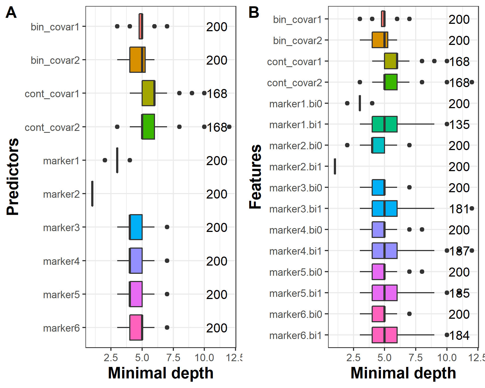

```{r, include = FALSE}
knitr::opts_chunk$set(
  collapse = TRUE,
  comment = "#>",
  eval = FALSE
)
```

## Introduction to `data_simu1` and `data_simu2` datasets

In this vignette, we present an illustration of `DynForest` with a continuous outcome. `DynForest` was used on a simulated dataset with 200 subjects and 10 predictors (6 time-dependent and 4 time-fixed predictors). The 6 longitudinal predictors were generated using a linear mixed model with linear trajectory according to time. We considered 6 measurements by subject (at baseline and then randomly drawn around theoretical annual visits up to 5 years). Then, we generated the continuous outcome using a linear regression with the baseline random-effect of marker 1 and slope random-effect of marker 2 as linear predictors. We generated two datasets (`data_simu1`} and `data_simu2`), one for each step (training and prediction).

The aim of this illustration is to predict the continuous outcome using time-dependent and time-fixed predictors.

## Managing data

First of all, we load the data and we build the mandatory objects needed to execute `DynForest()` function. We specify the model for the longitudinal predictors. For the illustration, we consider linear trajectories over time for the 6 longitudinal predictors.

```{r, eval = FALSE}
timeData_train <- data_simu1[,c("id","time",
                                paste0("marker",seq(6)))]
timeVarModel <- lapply(paste0("marker",seq(6)),
                       FUN = function(x){
                         fixed <- reformulate(termlabels = "time",
                                              response = x)
                         random <- ~ time
                         return(list(fixed = fixed, random = random))
                       })
fixedData_train <- unique(data_simu1[,c("id",
                                        "cont_covar1","cont_covar2",
                                        "bin_covar1","bin_covar2")])
```

To define the object for a continuous outcome, the `type` argument should be chosen to `numeric` to set up the random forest in regression mode. The dataframe `Y` should include two columns with the unique identifier `id` and the continuous outcome `Y_res`.

```{r, eval = FALSE}
Y <- list(type = "numeric",
          Y = unique(data_simu1[,c("id","Y_res")]))
```

## Build the random forest

To build the random forest, we chose default hyperparameters (i.e. `ntree` = 200 and `nodesize` = 1), except for `mtry` which was fixed to 10. We ran `DynForest()` function with the following code:
  
```{r, eval = FALSE}
res_dyn <- DynForest(timeData = timeData_train, 
                     fixedData = fixedData_train,
                     timeVar = "time", idVar = "id", 
                     timeVarModel = timeVarModel,
                     mtry = 10,
                     Y = Y, seed = 1234)
```

## Out-Of-Bag error

For continuous outcome, the OOB prediction error is evaluated using mean square error (MSE). We used `compute_OOBerror()` function to compute the OOB prediction error and we provided overall results with `summary()` function as below:

```{r, eval = FALSE}
res_dyn_OOB <- compute_OOBerror(DynForest_obj = res_dyn)
summary(res_dyn_OOB)

DynForest executed with regression mode 
	Splitting rule: Minimize weighted within-group variance 
	Out-of-bag error type: Mean square error 
	Leaf statistic: Mean 
---------------- 
Input 
	Number of subjects: 200 
	Longitudinal: 6 predictor(s) 
	Numeric: 2 predictor(s) 
	Factor: 2 predictor(s) 
---------------- 
Tuning parameters 
	mtry: 10 
	nodesize: 1 
	ntree: 200 
---------------- 
---------------- 
DynForest summary 
	Average depth by tree: 9.06 
	Average number of leaves by tree: 126.47 
	Average number of subjects by leaf: 3.03 
---------------- 
Out-of-bag error based on Mean square error 
	Out-of-bag error: 4.3663 
---------------- 
Time to build the random forest 
	Time difference of 4.74484 mins
---------------- 
```

The random forest was executed in regression mode (for a continuous outcome). The splitting rule aimed to minimize the weighted within-group variance. We built the random forest using 200 subjects and 10 predictors (6 time-dependent and 4 time-fixed predictors) with hyperparameters `ntree` = 200, `mtry` = 10 and `nodesize` = 1. As we can see, `nodesize` = 1 leads to deeper trees (the average depth by tree is 9.1) and few subjects by leaf (3 on average). We obtained 4.4 for the MSE. This quantity needs to be minimized using hyperparameters `mtry` and `nodesize`.

## Predict the outcome

In regression mode, the tree-specific predictions are averaged across the trees to get an unique prediction over the random forest. `predict()` function provides the individual predictions. We first created the objects with the same predictors used to build the random forest. We then predicted the continuous outcome by using the data.

```{r, eval = FALSE}
timeData_pred <- data_simu2[,c("id","time",
                               paste0("marker",seq(6)))]
fixedData_pred <- unique(data_simu2[,c("id","cont_covar1","cont_covar2",
                                       "bin_covar1","bin_covar2")])
pred_dyn <- predict(object = res_dyn,
                    timeData = timeData_pred, 
                    fixedData = fixedData_pred,
                    idVar = "id", timeVar = "time")
```

`predict()` function provides several results for the new subjects. We can extract from its returning object the individual predictions using the following code:
  
```{r, eval = FALSE}
head(pred_dyn$pred_indiv)

         1          2          3          4          5          6 
 5.2117462 -1.2899651  0.8591368  1.5115133  5.2957749  7.9194240 
```

For instance, we predicted 5.21 for subject 1, -1.29 for subject 2 and 0.86 for subject 3.

## Explore the most predictive variables

In this illustration, we want to evaluate if `DynForest` can identify the true predictors (i.e. baseline random-effect of marker1 and slope random-effect of marker2). To do this, we used the minimal depth which allows to understand the random forest at feature level.

This information about the minimal depth can be extracted using `var_depth()` function and can be displayed with `plot()` function. For the purpose of this illustration, we displayed the minimal depth in figure 1 by predictor and by feature.

```{r, eval = FALSE}
depth_dyn <- var_depth(DynForest_obj = res_dyn)
plot(x = depth_dyn, plot_level = "predictor")
plot(x = depth_dyn, plot_level = "feature")
```

```{r, fig.cap = "Figure 1: Average minimal depth level by predictor (A) and by feature (B).", eval = TRUE, echo = FALSE, out.width="70%"}

```

We observe in figure 1A that marker2 and marker1 have the lowest minimal depth, as expected. To go further, we also looked into the minimal depth computed on features. We perfectly identified the slope random-effect of marker2 (i.e. marker2.bi1) and the baseline random-effect of marker1 (i.e. marker1.bi0) as predictors in our simulation.
