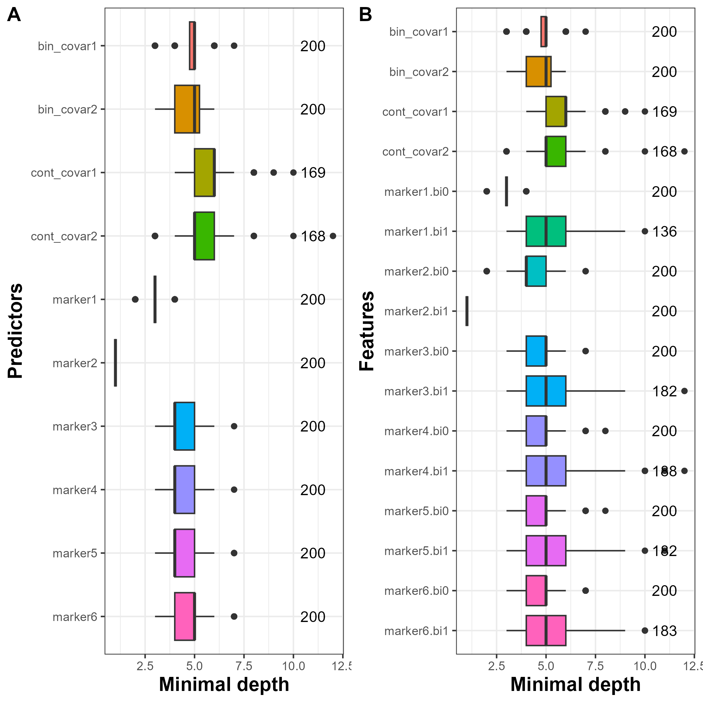

```{r setup, include = FALSE}
knitr::opts_chunk$set(
  collapse = TRUE,
  comment = "#>"
)
```

## Illustrative dataset: `data_simu1` and `data_simu2` datasets

In this section, we present an illustration of `DynForest` with a continuous outcome. `DynForest` was used on a simulated dataset with 200 subjects and 10 predictors (6 time-dependent and 4 time-fixed predictors). The 6 longitudinal predictors were generated using a linear mixed model with linear trajectory according to time. We considered 6 measurements by subject (at baseline and then randomly drawn around theoretical annual visits up to 5 years). Then, we generated the continuous outcome using a linear regression with the random intercept of marker 1 and random slope of marker 2 as linear predictors. We generated two datasets (`data_simu1` and `data_simu2`), one for each step (training and prediction). These datasets are available in the `DynForest` package.

## Data management

```{r, message = FALSE}
library("DynForest")
data(data_simu1)
head(data_simu1)
```

```{r}
data(data_simu2)
head(data_simu2)
```


First of all, we load the data and we build the mandatory objects needed to execute `dynforest()` function that are `timeData_train` for time-dependent predictors and `fixedData_train` for time-fixed predictors. We specify the model for the longitudinal predictors in `timeVarModel` object. We considered linear trajectories over time for the 6 longitudinal predictors.

```{r, eval = FALSE}
timeData_train <- data_simu1[,c("id","time",
                                paste0("marker",seq(6)))]
timeVarModel <- lapply(paste0("marker",seq(6)),
                       FUN = function(x){
                         fixed <- reformulate(termlabels = "time",
                                              response = x)
                         random <- ~ time
                         return(list(fixed = fixed, random = random))
                       })
fixedData_train <- unique(data_simu1[,c("id",
                                        "cont_covar1","cont_covar2",
                                        "bin_covar1","bin_covar2")])
```

To define the `Y` object for a continuous outcome, the `type` argument should be set to `numeric` to run the random forest in regression mode. The dataframe `Y` should include two columns with the unique identifier `id` and the continuous outcome, here `Y_res`.

```{r, eval = FALSE}
Y <- list(type = "numeric",
          Y = unique(data_simu1[,c("id","Y_res")]))
```

## The random forest building

To build the random forest, we chose default hyperparameters (i.e., `ntree` = 200 and `nodesize` = 1), except for `mtry` which was fixed at its maximum (i.e., `mtry` = 10). We ran `dynforest()` function with the following code:
  
```{r, eval = FALSE}
res_dyn <- dynforest(timeData = timeData_train, 
                     fixedData = fixedData_train,
                     timeVar = "time", idVar = "id", 
                     timeVarModel = timeVarModel,
                     mtry = 10, Y = Y, 
                     ncores = 7, seed = 1234)
```

## Out-Of-Bag error

For continuous outcome, the OOB prediction error is evaluated using the mean square error (MSE). We used `compute_ooberror()` function to compute the OOB prediction error and we provided overall results with `summary()` function as shown below:

```{r, eval = FALSE}
res_dyn_OOB <- compute_ooberror(dynforest_obj = res_dyn)
```

```{r, eval = FALSE, echo = TRUE}
summary(res_dyn_OOB)

dynforest executed for continuous outcome 
	Splitting rule: Minimize weighted within-group variance 
	Out-of-bag error type: Mean square error 
	Leaf statistic: Mean 
---------------- 
Input 
	Number of subjects: 200 
	Longitudinal: 6 predictor(s) 
	Numeric: 2 predictor(s) 
	Factor: 2 predictor(s) 
---------------- 
Tuning parameters 
	mtry: 10 
	nodesize: 1 
	ntree: 200 
---------------- 
---------------- 
dynforest summary 
	Average depth per tree: 9.06 
	Average number of leaves per tree: 126.47 
	Average number of subjects per leaf: 1 
---------------- 
Out-of-bag error based on Mean square error 
	Out-of-bag error: 4.3713 
---------------- 
Computation time 
	Number of cores used: 7 
	Time difference of 8.261093 mins
---------------- 
```

The random forest was executed in regression mode (for a continuous outcome). The splitting rule aimed to minimize the weighted within-group variance. We built the random forest using 200 subjects and 10 predictors (6 time-dependent and 4 time-fixed predictors) with hyperparameters `ntree` = 200, `mtry` = 10 and `nodesize` = 1. As we can see, `nodesize` = 1 leads to deeper trees (the average depth by tree is 9.1) and a single subject by leaf. We obtained 4.4 for the MSE. This quantity can be minimized by tuning hyperparameters `mtry` and `nodesize`.

## Prediction of the outcome

In regression mode, the tree and leaf-specific means are averaged across the trees to get a unique prediction over the random forest. `predict()` function provides the individual predictions. We first created the `timeData` and `fixedData` from the testing sample `data_simu2`. We then predicted the continuous outcome by running `predict()` function:

```{r, eval = FALSE}
timeData_pred <- data_simu2[,c("id","time",
                               paste0("marker",seq(6)))]
fixedData_pred <- unique(data_simu2[,c("id","cont_covar1","cont_covar2",
                                       "bin_covar1","bin_covar2")])
pred_dyn <- predict(object = res_dyn,
                    timeData = timeData_pred, 
                    fixedData = fixedData_pred,
                    idVar = "id", timeVar = "time")
```

Individual predictions can be extracted using `print()` function:
  
```{r, eval = FALSE, echo = TRUE}
head(print(pred_dyn))

         1          2          3          4          5          6 
 5.2184031 -1.2786887  0.8591368  1.5115312  5.2984117  7.9073981
```

For instance, we predicted 5.22 for subject 1, -1.28 for subject 2 and 0.86 for subject 3.

## Predictiveness of the variables 

In this illustration, we want to evaluate if \CRANpkg{DynForest} can identify the true predictors (i.e., random intercept of marker1 and random slope of marker2). To do this, we used the minimal depth which allows to understand the random forest at the feature level.

Minimal depth information can be extracted using `compute_vardepth()` function and can be displayed with `plot()` function. For the purpose of this illustration, we displayed the minimal depth in Figure 1 by predictor and by feature.

```{r, eval = FALSE, echo = TRUE, fig.show='hide'}
depth_dyn <- compute_vardepth(dynforest_obj = res_dyn)
p1 <- plot(depth_dyn, plot_level = "predictor")
p2 <- plot(depth_dyn, plot_level = "feature")
```

We observe in figure \@ref(fig:DynForestRdepthscalar)A that marker2 and marker1 have the lowest minimal depth, as expected. To go further, we also looked into the minimal depth computed on features. We perfectly identified the random slope of marker2 (i.e., marker2.bi1) and the random intercept of marker1 (i.e., marker1.bi0) as the predictors in this simulated dataset.

```{r, eval = FALSE, echo = TRUE}
plot_grid(p1, p2, labels = c("A", "B"))
```

```{r DynForestRdepthscalar, fig.cap = "Figure 1: Average minimal depth level by predictor (A) and by feature (B).", eval = TRUE, echo = FALSE, out.width="70%"}

```
