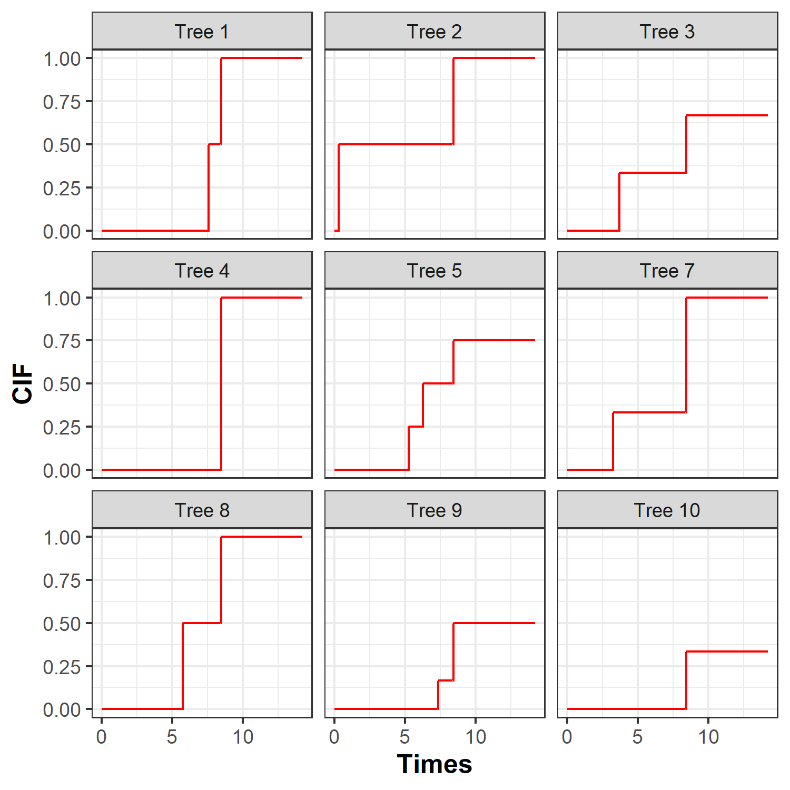
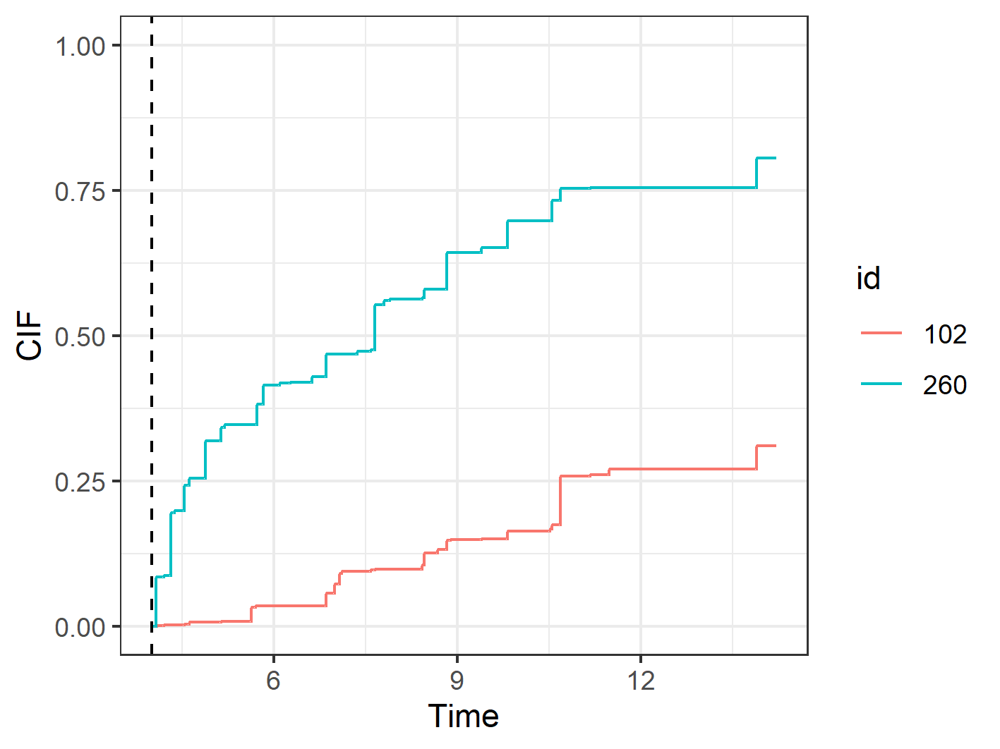
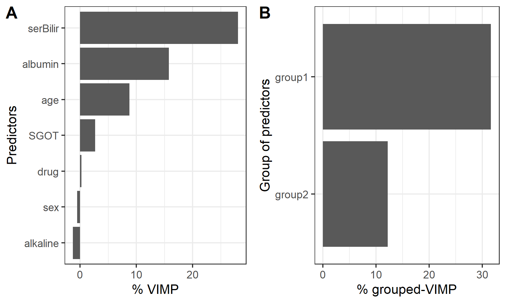
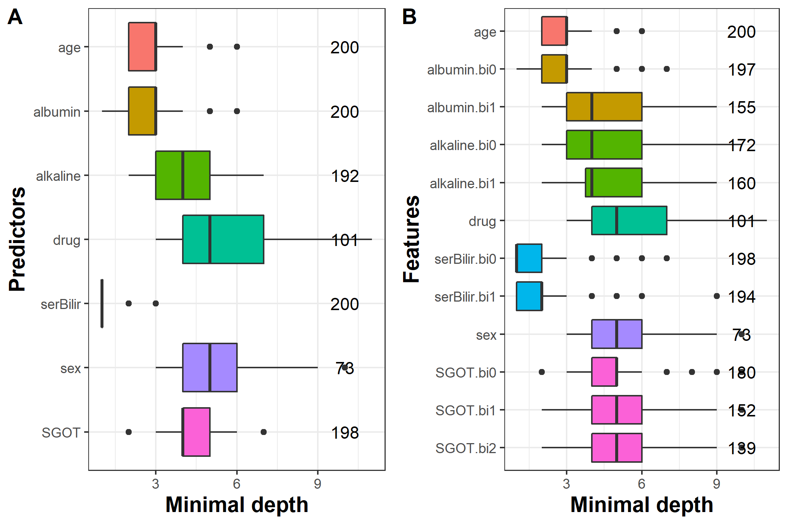
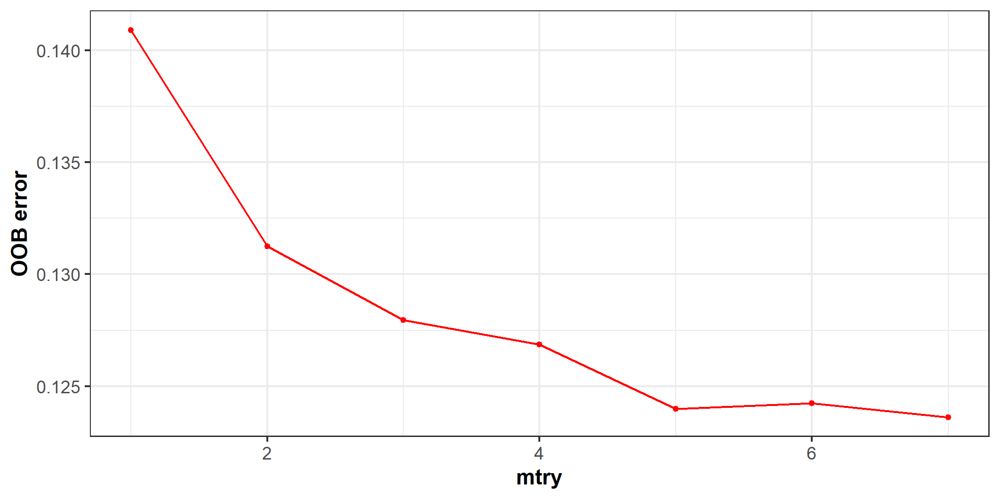

```{r, include = FALSE}
knitr::opts_chunk$set(
  collapse = TRUE,
  comment = "#>",
  eval = FALSE
)
```

## Introduction to `pbc2` dataset

We use `DynForest` on the `pbc2` dataset [@murtaugh_primary_1994] to illustrate our methodology. Data come from the clinical trial conducted by the Mayo Clinic between 1974 and 1984. For the illustration, we consider a subsample of the original dataset resulting to 312 patients and 7 predictors. Among these predictors, the level of serum bilirubin (serBilir), aspartate aminotransferase (SGOT), albumin and alkaline were measured at inclusion and during the follow-up leading to a total of 1945 observations. Sex, age and the drug treatment were collected at the enrollment. During the follow-up, 140 patients died before transplantation, 29 patients were transplanted and 143 patients were alive. The time of first event (alive or any event) was considered as the event time. We aim to predict in this illustration the death without transplantation on patients suffering from primary billiary cholangitis (PBC) using clinical and socio-demographic predictors, considering the transplantation as a competing event.

## Managing data

To begin, we load `DynForest` package and `pbc2` data and we split the subjects into two datasets: (i) one dataset to train the random forest using $2/3$ of patients; (ii) one dataset to predict on the other $1/3$ of patients.

```{r, eval = FALSE, echo = TRUE}
library("DynForest")
set.seed(1234)
id <- unique(pbc2$id)
id_sample <- sample(id, length(id)*2/3)
id_row <- which(pbc2$id%in%id_sample)
pbc2_train <- pbc2[id_row,]
pbc2_pred <- pbc2[-id_row,]
```

Then, we build the dataframe in the longitudinal format (i.e. one observation per row) for the longitudinal predictors including: `id` the unique patient identifier; `time` the observed time measurements; `serBilir`, `SGOT`, `albumin` and `alkaline` the longitudinal predictors. We also build the dataframe with the time-fixed predictors including: `id` the unique patient identifier; `age`, `drug` and `sex` predictors measured at enrollment. The nature of each predictor needs to be properly defined with `as.factor()` function for categorical predictors (e.g. `drug` and `sex`).

```{r, eval = FALSE, echo = TRUE}
timeData_train <- pbc2_train[,c("id","time",
                                "serBilir","SGOT",
                                "albumin","alkaline")]
fixedData_train <- unique(pbc2_train[,c("id","age","drug","sex")])
```

The first step aims to build the random forest using the `DynForest()` function. We need to specify the mixed model of each longitudinal predictor through a list containing the fixed and random formula for the fixed effect and random effects of the mixed models, respectively. To allow for a flexible trajectory over time, splines can be used in formula using `splines` package. 

```{r, eval = FALSE, echo = TRUE}
timeVarModel <- list(serBilir = list(fixed = serBilir ~ time,
                                     random = ~ time),
                     SGOT = list(fixed = SGOT ~ time + I(time^2),
                                 random = ~ time + I(time^2)),
                     albumin = list(fixed = albumin ~ time,
                                    random = ~ time),
                     alkaline = list(fixed = alkaline ~ time,
                                     random = ~ time))
```

Here, we assume a linear trajectory for `serBilir`, `albumin` and `alkaline`, and quadratic trajectory for `SGOT.` 
For this illustration, we build the outcome object containing a list with `type` set to `surv` (for survival data) and `Y` contains a dataframe in wide format (one subject per row) with: `id` the unique patient identifier; `years` the time-to-event data; `event` the event indicator.

```{r, eval = FALSE, echo = TRUE}
Y <- list(type = "surv",
          Y = unique(pbc2[,c("id","years","event")]))
```

## Build the random forest {#sec:DynForestR_estimRF}

We build the random forest using `DynForest()` function with the following code:
  
```{r, eval = FALSE, echo = TRUE}
res_dyn <- DynForest(timeData = timeData_train, 
                     fixedData = fixedData_train,
                     timeVar = "time", idVar = "id", 
                     timeVarModel = timeVarModel, Y = Y,
                     ntree = 200, mtry = 3, nodesize = 2, minsplit = 3,
                     cause = 2, seed = 1234)
```

In a survival context with multiple events, it is also necessary to specify the event of interest with the argument `cause`. We thus fixed `cause` = 2 to specify the event of interest (i.e. the death event). For the hyperparameters, we arbitrarily chose `mtry` = 3, `nodesize` = 2 and `minsplit` = 3.

Overall information about the random forest can be output with `summary()` function. The summary for the random forest in our illustration is displayed below:
  
```{r, eval = FALSE, echo = TRUE}
summary(res_dyn)

DynForest executed with survival (competing risk) mode 
	Splitting rule: Fine & Gray statistic test 
	Out-of-bag error type: Integrated Brier Score 
	Leaf statistic: Cumulative incidence function 
---------------- 
Input 
	Number of subjects: 208 
	Longitudinal: 4 predictor(s) 
	Numeric: 1 predictor(s) 
	Factor: 2 predictor(s) 
---------------- 
Tuning parameters 
	mtry: 3 
	nodesize: 2 
	minsplit: 3 
	ntree: 200 
---------------- 
---------------- 
DynForest summary 
	Average depth by tree: 6.61 
	Average number of leaves by tree: 28.01 
	Average number of subjects by leaf: 4.71 
	Average number of events of interest by leaf: 1.91 
---------------- 
Out-of-bag error based on Integrated Brier Score 
	Out-of-bag error: Not computed! 
---------------- 
Time to build the random forest 
	Time difference of 3.000176 mins
---------------- 
```

We executed `DynForest()` function in survival mode with competing events. In this mode, we use the Fine \& Gray statistic test for the splitting rule and the cumulative incidence function (CIF) for the leaf statistic. To build the random forest, we included 208 subjects with 4 longitudinal (`Longitudinal`), 1 continuous (`Numeric`) and 2 categorical (`Factor`) predictors. The `summary()` function also returns some statistics about the trees. For instance, we have on average 4.7 subjects and 1.9 death events by leaf. The number of subjects by leaf should always be higher than `nodesize` hyperparameter. OOB error should be first computed using `compute_OOBerror()` function (see section below) to be displayed on summary output.

To further investigate the process in each tree, the split details for the tree 1 can be output with the following code:

```{r, eval = FALSE, echo = TRUE}
head(res_dyn$rf[,1]$V_split)

          type id_node var_split feature   threshold   N Nevent depth
1 Longitudinal       1         3       1 -0.21993804 129     49     1
2 Longitudinal       2         2       1  5.57866304  26     21     2
3      Numeric       3         1      NA 61.83057715 103     28     2
4 Longitudinal       4         2       3  1.42021938  18     13     3
5       Factor       5         1      NA          NA   8      8     3
6 Longitudinal       6         3       2 -0.01010312  92     22     3
```

```{r, eval = FALSE, echo = TRUE}
tail(res_dyn$rf[,1]$V_split)

           type id_node var_split feature threshold N Nevent depth
48         Leaf     192        NA      NA        NA 4      2     8
49         Leaf     193        NA      NA        NA 2      2     8
50         Leaf     194        NA      NA        NA 2      1     8
51 Longitudinal     195         4       1 -27.58024 4      3     8
52         Leaf     390        NA      NA        NA 2      1     9
53         Leaf     391        NA      NA        NA 2      2     9
```

\noindent For instance for the interpretation of the node split, the subjects were split at node 1 (`id_node`) using the first random-effect (`feature` = 1) of the third `Longitudinal` predictor (`var_split` = 3) with `threshold` = -0.2199. The predictor name can be found using the predictor number in `timeData` and `fixedData` datasets. Therefore, the subjects at node 1 with `albumin` values below to -0.2199 drop in node 2, otherwise in node 3. Another example with the leaves, 4 subjects are included in the 192, and among them 2 subjects have the event of interest. 

Estimated cumulative incidence function (CIF) for a single tree can be displayed using `Y_pred` element of `rf`. For instance, the CIF of the cause of interest for leaf 192 can be displayed using the following code:
  
```{r, eval = FALSE, echo = TRUE}
plot(res_dyn$rf[,1]$Y_pred[[192]]$`2`, type = "l", col = "red", 
     xlab = "Years", ylab = "CIF", ylim = c(0,1))
```

However, CIF computed on a single tree is not relevant. It should also be computed over all trees of the random forest. For a subject, estimated CIF over the random forest is obtained by averaging the tree-specific CIF of the leaf where the subject belongs. For instance, for subject 104, we display in figure 1 the tree-specific CIF for the 9 first trees where this subject is used to grow the trees. This figure shows how the estimated CIF can be differ across the trees and requires to be averaged as they are obtained on a few subjects from the leaves in which subject 104 is assigned.

```{r, fig.cap = "Figure 1: Estimated cumulative incidence functions of death before transplantation for subject 104 over 9 trees.", eval = TRUE, echo = FALSE, out.width="70%"}

```

## Out-Of-Bag error

The Out-Of-Bag error (OOB) aims at assessing the prediction abilities of the random forest. It is computed using `compute_OOBerror()` function with a `DynForest` class object as main argument, such as:
  
```{r, eval = FALSE, echo = TRUE}
res_dyn_OOB <- compute_OOBerror(DynForest_obj = res_dyn)
```

`compute_OOBerror()` returns the OOB error by individual (`oob.err`) and the overall OOB error for the random forest can be obtained by averaging the OOB error. 

```{r, eval = FALSE, echo = TRUE}
mean(res_dyn_OOB$oob.err)

[1] 0.1238627
```

In a survival context, the OOB error is evaluated using the Integrated Brier Score (IBS) [@gerds_consistent_2006]. We obtain an IBS of 0.124 computed from time 0 to the maximum event time. The time range can be modified using `IBS.min` and `IBS.max` arguments to define the minimum and maximum, respectively. To maximize the prediction ability of the random forest, we want to minimize the OOB error. This can be done by tuning the hyperparameters. OOB error can also be displayed using `summary()` function applied to the returning object.

## Predict the outcome

The software allows to predict the outcome for a new subject using the trained random forest. Dynamic predictions can be computed by fixing a prediction time (called landmark time) from which prediction is made using all the history of the individual up to this landmark time (including the longitudinal and time-fixed predictors).

For the illustration, we only select the subjects still at risk at the landmark time of 4 years. We build the dataframe for those subjects and we predict the individual specific CIF using `predict()` function as follows:
  
```{r, eval = FALSE, echo = TRUE}
id_pred <- unique(pbc2_pred$id[which(pbc2_pred$years>4)])
pbc2_pred_tLM <- pbc2_pred[which(pbc2_pred$id%in%id_pred),]
timeData_pred <- pbc2_pred_tLM[,c("id","time",
                                  "serBilir","SGOT",
                                  "albumin","alkaline")]
fixedData_pred <- unique(pbc2_pred_tLM[,c("id","age","drug","sex")])
pred_dyn <- predict(object = res_dyn, 
                    timeData = timeData_pred, 
                    fixedData = fixedData_pred,
                    idVar = "id", timeVar = "time",
                    t0 = 4)
```

`predict()` function provides several elements. To get more graphical results, the `plot_CIF()` function can be used to display the CIF of death before transplantation for given subjects. For instance, we computed the CIF for subjects 102 and 260 with the following code and displayed them on the figure 2.

```{r, eval = FALSE, echo = TRUE}
plot_CIF(DynForestPred_obj = pred_dyn,
         id = c(102, 260))
```

```{r, fig.cap = "Figure 2: Predicted cumulative incidence function for subjects 102 and 260 from landmark time of 4 years (represented by a dashed line).", eval = TRUE, echo = FALSE, out.width="70%"}

```

The first year after the landmark time (at 4 years), we observe a rapid increase of the risk of death for subject 260 compared to subject 102. We also notice that after 10 years from landmark time, subject 260 has a probability of death almost three times higher that the one of subject 102.

## Explore the most predictive variables

### Variable importance

The main objective of the random forest is to predict an outcome. But usually, we are interested to identify which predictors are the most predictive. The VIMP statistic can be computed using `compute_VIMP()` function. This function returns the VIMP statistic for each predictor with `Importance` element. These results can also be displayed using `plot()` function in percentage with `PCT` argument set to `TRUE`.

```{r, eval = FALSE, echo = TRUE}
res_dyn_VIMP <- compute_VIMP(DynForest_obj = res_dyn, seed = 123)
plot(x = res_dyn_VIMP, PCT = TRUE)
```

The VIMP results are displayed in figure 3A. The most predictive variables are `serBilir`, `albumin` and `age` with the largest VIMP percentage. Without `serBilir`, the OOB error of prediction was reduced by 28%.

In the case of correlated predictors, the predictors can be regrouped into dimensions and the VIMP can be computed at the dimension group level with the gVIMP statistic. Permutation is done for each variable of the group simultaneously. The gVIMP is computed with the `compute_gVIMP()` function. This function has the `group` argument to define the group of predictors as a list. For instance, with two groups of predictors (named group1 and group2), the gVIMP statistic is computed using the following code:
  
```{r, eval = FALSE, echo = TRUE}
group <- list(group1 = c("serBilir","SGOT"),
              group2 = c("albumin","alkaline"))
res_dyn_gVIMP <- compute_gVIMP(DynForest_obj = res_dyn,
                               group = group, seed = 123)
plot(x = res_dyn_gVIMP, PCT = TRUE)
```

Similar to VIMP statistic, the gVIMP results can be displayed using `plot()` function. The figure 3B shows that group1 has the highest gVIMP percentage with 32%.

```{r, fig.cap = "Figure 3: Using VIMP statistic (A), we observe that `serBilir` and `albumin` are the most predictive predictors. Using grouped-VIMP statistic (B), group1 (`serBilir` and `SGOT`) has more predictive ability than group2 (`albumin` and `alkaline`).", eval = TRUE, echo = FALSE, out.width="70%"}

```

To compute the gVIMP statistic, the groups can be defined regardless of the number of predictors. However, the comparison between the groups may be harder when group sizes are very different.

### Minimal depth

To go further into the understanding of the tree building process, the `var_depth()` function extracts useful information about the average minimal depth by feature (`min_depth`), the minimal depth for each feature and each tree (`var_node_depth`), the number of times that the feature is used for splitting for each feature and each tree (`var_count`). 

Using an object from `var_depth()` function, `plot()` function allows to plot the distribution of the average minimal depth across the trees. `plot_level` argument defines how the average minimal depth is plotted, by predictor or feature.

```{r, eval = FALSE, echo = TRUE}
res_dyn_max <- DynForest(timeData = timeData_train, 
                         fixedData = fixedData_train,
                         timeVar = "time", idVar = "id", 
                         timeVarModel = timeVarModel, Y = Y,
                         ntree = 200, mtry = 7, nodesize = 2, minsplit = 3, 
                         cause = 2, seed = 1234)
depth_dyn <- var_depth(DynForest_obj = res_dyn_max)
plot(x = depth_dyn, plot_level = "predictor")
plot(x = depth_dyn, plot_level = "feature")
```

The distribution of the minimal depth level is displayed in figure 4 by predictor and feature. Note that the minimal depth level should always be interpreted with the number of trees where the predictor/feature is found. Indeed, to accurately appreciate the importance of a variable minimal depth, it has to be part of the candidates at each node. This is why we strongly advice to compute the minimal depth on random forest with `mtry` hyperparameter chosen at its maximum.

In our example, we ran a random forest with `mtry` hyperparameter set to its maximum (i.e. `mtry` = 7) and we computed the minimal depth on this random forest. We observe that `serBilir`, `albumin` and `age` have the lowest minimal depth, indicating these predictors are used to split the subjects at early stage in 200 out of 200 trees, i.e 100% (figure 4A). The minimal depth level by feature (figure 4B) provides more advanced details about the tree building process. For instance, we can see that the random-effects for `serBilir` (indicating by bi0 and bi1 on the graph) are the earliest features used on 198 and 194 out of 200 trees, respectively.

```{r, fig.cap = "Figure 4: Average minimal depth level by predictor (A) and feature (B).", eval = TRUE, echo = FALSE, out.width="70%"}

```

## Guidelines to tune the hyperparameters

The predictive performance of the random forest strongly depends on the hyperparameters `mtry`, `nodesize` and `minsplit`, and should therefore be chosen thoroughly. `nodesize` and `minsplit` hyperparameters control the tree depth. The trees need to be deep enough to ensure that the predictions are accurate. By default in `DynForest()` function, we fixed `nodesize` = 1 and `minsplit` = 2, being the minimum. However, with a large number of individuals, the tree depth could be slighty decreased by increasing these hyperparameters to reduce the computation time. 

`mtry` hyperparameter defines the number of predictors randomly drawn at each node. By default, we chose `mtry` equal to the square root of the number of predictors as usually recommanded [@bernard_influence_2009]. However, this hyperparameter should be carefully tuned with possible values between 1 and the number of predictors. Indeed, the predictive performance of the random forest is highly related to this hyperparameter.

In the illustration, we tuned `mtry` for every possible values (1 to 7). The figure 5 displays the evolution of the OOB error according to `mtry` hyperparameter.

```{r, fig.cap = "Figure 5: OOB error according to `mtry` hyperparameter. The optimal value was found for `mtry` = 7.", eval = TRUE, echo = FALSE, out.width="70%"}

```

We can see on this figure large OOB error difference according to `mtry` hyperparameter. In particular, we observe the worst predictive performance for lower values, then similar results with values from 5 to 7. The optimal value (i.e. with the lowest OOB error) was found with `mtry` = 7. This graph reflects how it is crucial to carefully tune this hyperparameter.

## References
