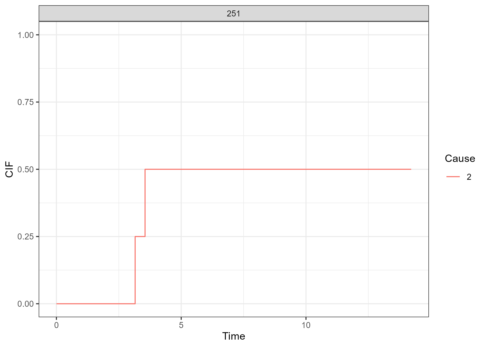
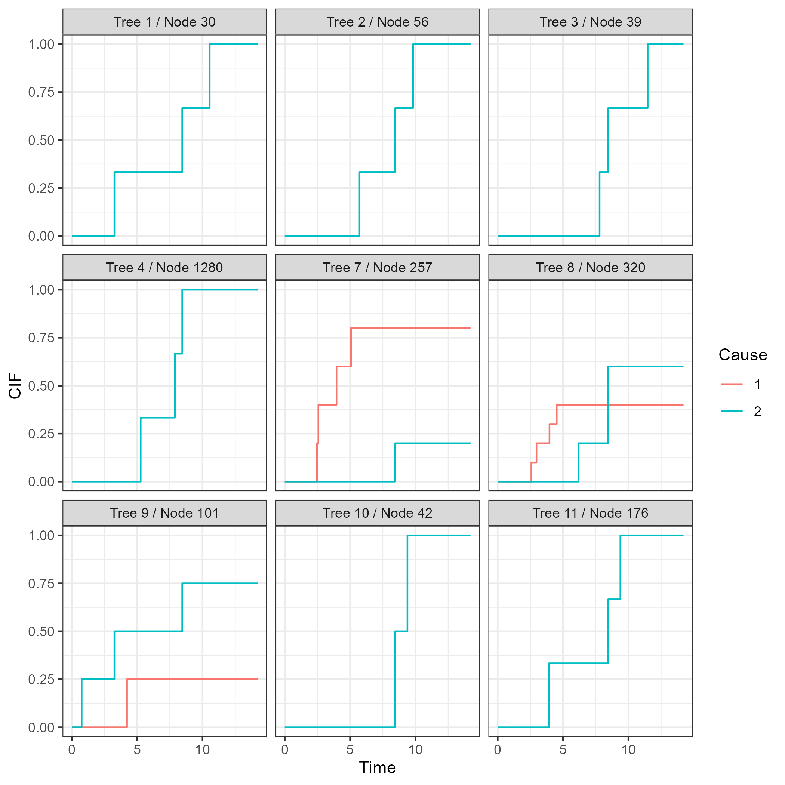
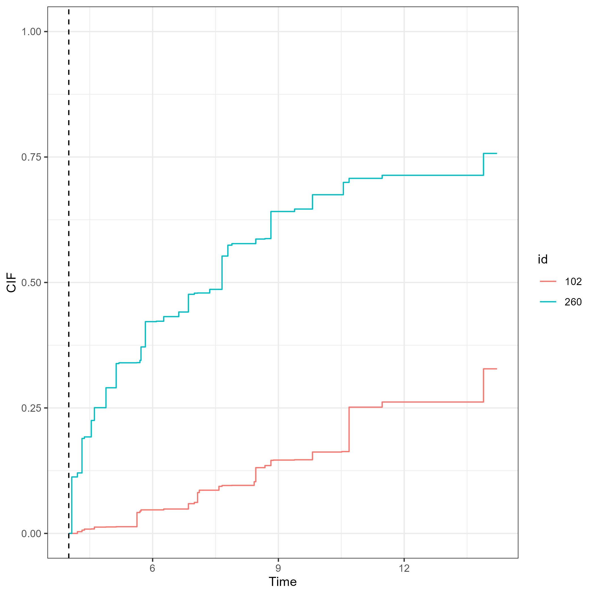
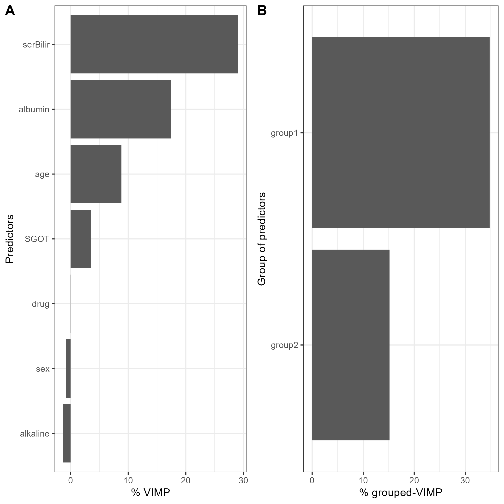
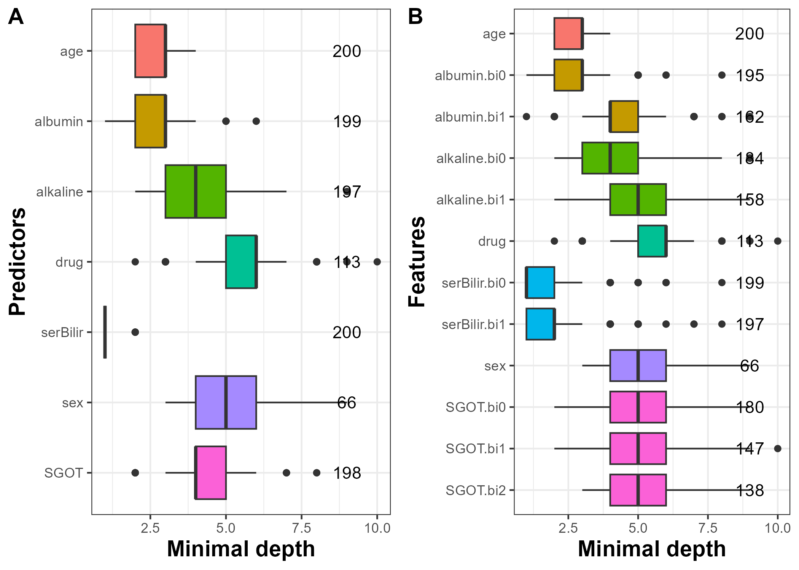
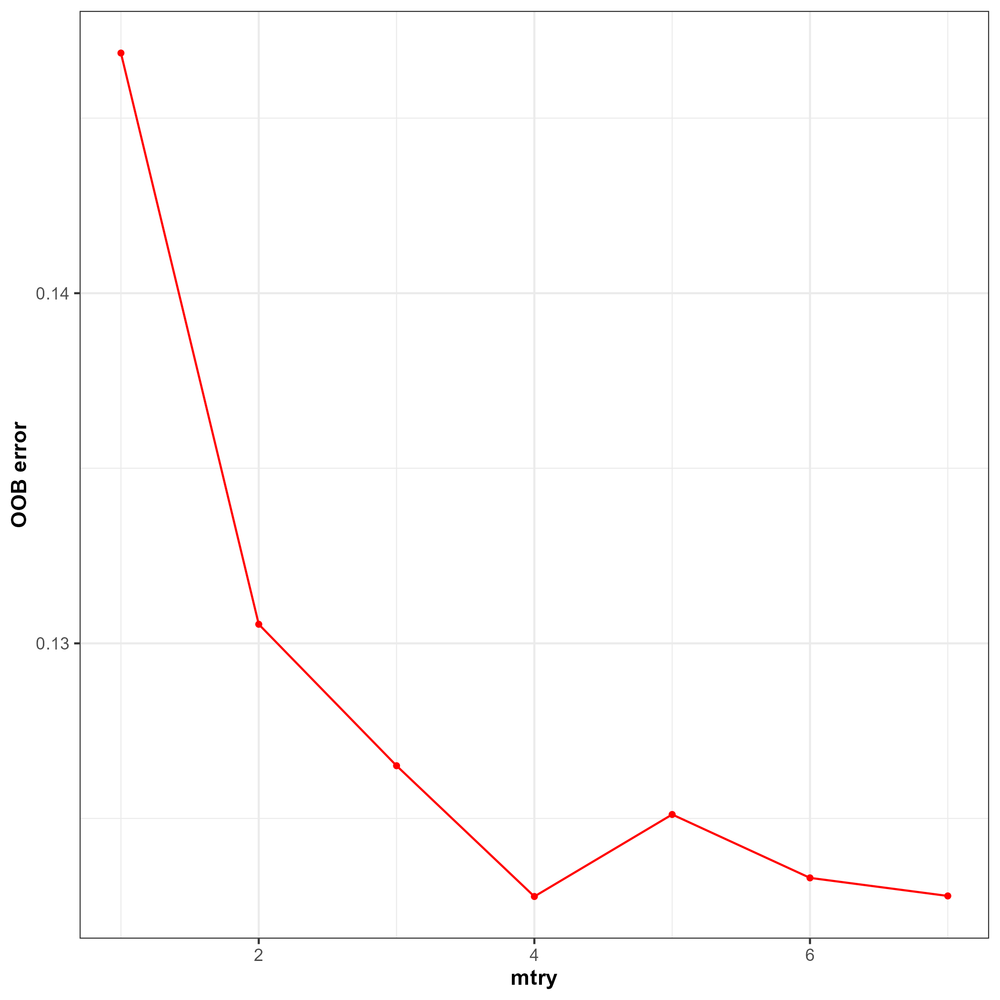

```{r setup, include = FALSE}
knitr::opts_chunk$set(
  collapse = TRUE,
  comment = "#>"
)
```


## Illustrative dataset: `pbc2` dataset

The `pbc2` dataset [@murtaugh_primary_1994] is loaded with the package `DynForest` to illustrate its function abilities. `pbc2` data come from a clinical trial conducted by the Mayo Clinic between 1974 and 1984 to treat the primary biliary cholangitis (PBC), a chronic liver disease. 312 patients were enrolled in a clinical trial to evaluate the effectiveness of D-penicillamine compared to a placebo to treat the PBC and were followed since the clinical trial ends, leading to a total of 1945 observations. During the follow-up, several clinical continuous markers were collected over time such as: the level of serum bilirubin (`serBilir`), the level of serum cholesterol (`serChol`), the level of albumin (`albumin`), the level of alkaline (`alkaline`), the level of aspartate aminotransferase (`SGOT`), platelets count (`platelets`) and the prothrombin time (`prothrombin`). 4 non-continuous time-dependent predictors were also collected: the presence of ascites (`ascites`), the presence of hepatomegaly (`hepatomegaly`), the presence of blood vessel malformations in the skin (`spiders`) and the edema levels (`edema`). These time-dependent predictors were recorded according to `time` variable. In addition to these time-dependent predictors, few predictors were collected at enrollment: the sex (`sex`), the age (`age`) and the drug treatment (`drug`). During the follow-up, 140 patients died before transplantation, 29 patients were transplanted and 143 patients were censored alive (`event`). The time of first event (censored alive or any event) was considered as the event time (`years`)

```{r, message = FALSE}
library("DynForest")
data(pbc2)
head(pbc2)
```

For the illustration, 4 time-dependent predictors (`serBilir`, `SGOT`, `albumin` and `alkaline`) and 3 predictors measured at enrollment (`sex`, `age` and `drug`) were considered. We aim to predict the death without transplantation on patients suffering from primary biliary cholangitis (PBC) using clinical and socio-demographic predictors, considering the transplantation as a competing event.

## Data management

To begin, we split the subjects into two datasets: (i) one dataset to train the random forest using $2/3$ of patients; (ii) one dataset to predict on the other $1/3$ of patients. The random seed is set to 1234 for replication purpose.

```{r, eval = FALSE, echo = TRUE}
set.seed(1234)
id <- unique(pbc2$id)
id_sample <- sample(id, length(id)*2/3)
id_row <- which(pbc2$id %in% id_sample)
pbc2_train <- pbc2[id_row,]
pbc2_pred <- pbc2[-id_row,]
```

Then, we build the dataframe `timeData_train` in the longitudinal format (i.e., one observation per row) for the longitudinal predictors including: `id` the unique patient identifier; `time` the observed time measurements; `serBilir`, `SGOT`, `albumin` and `alkaline` the longitudinal predictors. We also build the dataframe `fixedData_train` with the time-fixed predictors including: `id` the unique patient identifier; `age`, `drug` and `sex` predictors measured at enrollment. The nature of each predictor needs to be properly defined with `as.factor()` function for categorical predictors (e.g., `drug` and `sex`).

```{r, eval = FALSE, echo = TRUE}
timeData_train <- pbc2_train[,c("id","time",
                                "serBilir","SGOT",
                                "albumin","alkaline")]
fixedData_train <- unique(pbc2_train[,c("id","age","drug","sex")])
```

## Specification of the models for the time-dependent predictors

The first step of the random forest building consists in specify the mixed model of each longitudinal predictor through a list containing the fixed and random formula for the fixed effect and random effects of the mixed models, respectively. Here, we assume a linear trajectory for `serBilir`, `albumin` and `alkaline`, and quadratic trajectory for `SGOT.` Although, we restricted this example to linear and quadratic functions of time, we note that any function can be considered including splines.

```{r, eval = FALSE, echo = TRUE}
timeVarModel <- list(serBilir = list(fixed = serBilir ~ time,
                                     random = ~ time),
                     SGOT = list(fixed = SGOT ~ time + I(time^2),
                                 random = ~ time + I(time^2)),
                     albumin = list(fixed = albumin ~ time,
                                    random = ~ time),
                     alkaline = list(fixed = alkaline ~ time,
                                     random = ~ time))
```

For this illustration, the outcome object contains a list with `type` set to `surv` (for survival data) and `Y` contain's a dataframe in wide format (one subject per row) with: `id` the unique patient identifier; `years` the time-to-event data; `event` the event indicator.

```{r, eval = FALSE, echo = TRUE}
Y <- list(type = "surv",
          Y = unique(pbc2_train[,c("id","years","event")]))
```


## Random forest building

We build the random forest using `dynforest()` function with the following code:
  
```{r, eval = FALSE, echo = TRUE}
res_dyn <- dynforest(timeData = timeData_train, 
                     fixedData = fixedData_train,
                     timeVar = "time", idVar = "id", 
                     timeVarModel = timeVarModel, Y = Y,
                     ntree = 200, mtry = 3, nodesize = 2, minsplit = 3,
                     cause = 2, ncores = 7, seed = 1234)
```

In a survival context with multiple events, it is necessary to specify the event of interest with the argument `cause.` We thus fixed `cause` = 2 to specify the event of interest (i.e., the death event). For the hyperparameters, we arbitrarily chose `mtry` = 3, `nodesize` = 2 and `minsplit` = 3 and we will discuss this point in section 4.8.

Overall information about the random forest can be output with the `summary()` function as displayed below for our example:
  
```{r, eval = FALSE, echo = TRUE}
summary(res_dyn)

dynforest executed for survival (competing risk) outcome 
	Splitting rule: Fine & Gray statistic test 
	Out-of-bag error type: Integrated Brier Score 
	Leaf statistic: Cumulative incidence function 
---------------- 
Input 
	Number of subjects: 208 
	Longitudinal: 4 predictor(s) 
	Numeric: 1 predictor(s) 
	Factor: 2 predictor(s) 
---------------- 
Tuning parameters 
	mtry: 3 
	nodesize: 2 
	minsplit: 3 
	ntree: 200 
---------------- 
---------------- 
dynforest summary 
	Average depth per tree: 6.62 
	Average number of leaves per tree: 27.68 
	Average number of subjects per leaf: 4.78 
	Average number of events of interest per leaf: 1.95 
---------------- 
Computation time 
	Number of cores used: 7 
	Time difference of 3.18191 mins
---------------- 
```

We executed `dynforest()` function for a survival outcome with competing events. In this mode, we use the Fine \& Gray statistic test as the splitting rule and the cumulative incidence function (CIF) as the leaf statistic. To build the random forest, we included 208 subjects with 4 longitudinal (`Longitudinal`), 1 continuous (`Numeric`) and 2 categorical (`Factor`) predictors. The `summary()` function returns some statistics about the trees. For instance, we have on average 4.8 subjects and 1.9 death events per leaf. The number of subjects per leaf should always be higher than `nodesize` hyperparameter. OOB error should be first computed using `compute_ooberror()` function (see section 4.5) to be displayed on summary output.

To further investigate the tree structure, the split details can be output using `get_tree()` function with the following code (for tree 1):

```{r, eval = FALSE, echo = TRUE}
head(get_tree(dynforest_obj = res_dyn, tree = 1))

          type id_node var_split feature     threshold   N Nevent depth
1 Longitudinal       1         3       1 -1.272629e-01 129     51     1
2      Numeric       2         1      NA  4.138210e+01  39     27     2
3 Longitudinal       3         4       1  1.459346e+02  90     24     2
4 Longitudinal       4         3       1  3.608271e-11   8      3     3
5 Longitudinal       5         2       1  5.924123e+01  31     24     3
6 Longitudinal       6         1       1  2.786575e-01  63     12     3
```


```{r, eval = FALSE, echo = TRUE}
tail(get_tree(dynforest_obj = res_dyn, tree = 1))

           type id_node var_split feature     threshold N Nevent depth
50         Leaf     174        NA      NA            NA 2      2     8
51 Longitudinal     175         2       1 -1.850322e-10 4      4     8
52         Leaf     250        NA      NA            NA 5      1     8
53         Leaf     251        NA      NA            NA 4      2     8
54         Leaf     350        NA      NA            NA 2      2     9
55         Leaf     351        NA      NA            NA 2      2     9
```


\noindent Looking at the head of `get_tree()` function output, we see that subjects were split at node 1 (`id_node`) using the first random-effect (`feature` = 1) of the third `Longitudinal` predictor (`var_split` = 3) with `threshold` = -0.1273. `var_split` = 3 corresponds to `albumin`, so subjects at node 1 with `albumin` values below to -0.1273 are assigned in node 2, otherwise in node 3. The last rows of random forest given by the tail of `get_tree()` function output provide the leaves descriptions. For instance, row 53, 4 subjects are included in leaf 251, and 2 subjects have the event of interest. 


Estimated cumulative incidence function (CIF) which in each leaf of a tree can be displayed using `plot()` function. For instance, the CIF of the cause of interest for leaf 251 in the tree 1 can be displayed using the following code:
  
```{r, eval = FALSE, echo = TRUE}
plot(res_dyn, tree = 1, nodes = 251)
```

```{r, fig.cap = "Figure 1: Estimated cumulative incidence functions in tree 1 and node 251.", eval = TRUE, echo = FALSE, out.width="70%"}

```

CIF of a single tree is not meant to be interpreted alone. The CIF should be average over all trees of the random forest. For a subject, estimated CIF over the random forest is obtained by averaging all the tree-specific CIF of the tree-leaf where the subject belongs. This can be done with the `plot()` function such as:

```{r, eval = FALSE, echo = TRUE}
plot(res_dyn, id = 104, max_tree = 9)
```

```{r DynForestRCIF, fig.cap = "Figure 2: Estimated cumulative incidence functions for subject 104 over 9 trees.", eval = TRUE, echo = FALSE, out.width="70%"}

```

In this example, we display in Figure 2 for subject 104 the tree-specific CIF for the 9 first trees where this subject is used to grow the trees. This figure shows how the estimated CIF can be differ across the trees and requires to be averaged as each is calculated from information of the few subjects belonging to a leaf.


## Out-Of-Bag error

The Out-Of-Bag error (OOB) aims at assessing the prediction abilities of the random forest. With a survival outcome, the OOB error is evaluated using the Integrated Brier Score (IBS) [@gerds_consistent_2006]. It is computed using `compute_ooberror()` function with an object of class `dynforest` as main argument, such as:
  
```{r, eval = FALSE, echo = TRUE}
res_dyn_OOB <- compute_ooberror(dynforest_obj = res_dyn)
```

`compute_ooberror()` returns the OOB errors by individual. The overall OOB error for the random forest is obtained by averaging the individual specific OOB error, and can be displayed using `print()` or directly by calling the object. 

```{r, eval = FALSE, echo = TRUE}
res_dyn_OOB

[1] 0.1265053
```

We obtain an IBS of 0.127 computed from time 0 to the maximum event time. The time range can be modified using `IBS.min` and `IBS.max` arguments to define the minimum and maximum, respectively. To maximize the prediction ability of the random forest, the hyperparameters can be tuned, that is chosen as those that minimize the OOB error (see section 4.8).

## Individual prediction of the outcome

The `predict()` function allows to predict the outcome for a new subject using the trained random forest. The function requires the individual data: time-dependent predictors in `timeData` and time-fixed predictors in `fixedData.` For a survival outcome, dynamic predictions can be computed by fixing a prediction time (called landmark time, argument `t0`) from which prediction is made. In this case, only the history of the individual up to this landmark time (including the longitudinal and time-fixed predictors) will be used. In particular, if landmark time is fixed to 0, only the information at time 0 will be considered for predicting the outcome.

For the illustration, we only select the subjects still at risk at the landmark time of 4 years. We build the dataframe for those subjects and we predict the individual-specific CIF using `predict()` function as follows:
  
```{r, eval = FALSE, echo = TRUE}
id_pred <- unique(pbc2_pred$id[which(pbc2_pred$years>4)])
pbc2_pred_tLM <- pbc2_pred[which(pbc2_pred$id %in% id_pred),]
timeData_pred <- pbc2_pred_tLM[,c("id","time",
                                  "serBilir","SGOT",
                                  "albumin","alkaline")]
fixedData_pred <- unique(pbc2_pred_tLM[,c("id","age","drug","sex")])
pred_dyn <- predict(object = res_dyn, 
                    timeData = timeData_pred, 
                    fixedData = fixedData_pred,
                    idVar = "id", timeVar = "time",
                    t0 = 4)
```

The `predict()` function provides several elements as described in section 3.2. In addition, the `plot()` function can be used to display the CIF of the outcome (here death before transplantation) for subjects indicated with argument `id`. For instance, we compute the CIF for subjects 102 and 260 with the following code and display them in Figure 3.

```{r, eval = FALSE, echo = TRUE}
plot(pred_dyn, id = c(102, 260))
```

```{r DynForestRpredCIF, fig.cap = "Figure 3: Predicted cumulative incidence function for subjects 102 and 260 from landmark time of 4 years (represented by the dashed vertical line)", eval = TRUE, echo = FALSE, out.width="70%"}

```

The first year after the landmark time (at 4 years), we observe a rapid increase of the risk of death for subject 260 compared to subject 102. We also notice that after 10 years from landmark time, subject 260 has a probability of death almost three times higher that the one of subject 102.

## Predictiveness of the variables

### Variable importance

The main objective of the random forest is to predict an outcome. But usually, we are interested in identifying which predictors are the most predictive. The VIMP statistic [@ishwaran_random_2008] can be computed using `compute_vimp()` function. This function returns the VIMP statistic for each predictor with `$Importance` element. These results can also be displayed using `plot()` function, either in absolute value by default or in percentage with `PCT` argument set to `TRUE`.

```{r, eval = FALSE, echo = TRUE}
res_dyn_VIMP <- compute_vimp(dynforest_obj = res_dyn, seed = 123)
```

```{r, eval = FALSE, echo = TRUE, fig.show='hide'}
p1 <- plot(res_dyn_VIMP, PCT = TRUE)
```


The VIMP results are displayed in Figure 4A. The most predictive variables are `serBilir`, `albumin` and `age` with the largest VIMP percentage. By removing the association between `serBilir` and the event, the OOB error was increased by 30\%.

In the case of correlated predictors, the predictors can be regrouped into dimensions and the VIMP can be computed at the dimension group level with the gVIMP statistic. Permutation is done for each variable of the group simultaneously. The gVIMP is computed with the `compute_gvimp()` function in which the `group` argument defines the group of predictors as a list. For instance, with two groups of predictors (named group1 and group2), the gVIMP statistic is computed using the following code:
  
```{r, eval = FALSE, echo = TRUE}
group <- list(group1 = c("serBilir","SGOT"),
              group2 = c("albumin","alkaline"))
res_dyn_gVIMP <- compute_gvimp(dynforest_obj = res_dyn,
                               group = group, seed = 123)
```

```{r, eval = FALSE, echo = TRUE, fig.show='hide'}
p2 <- plot(res_dyn_gVIMP, PCT = TRUE)
```

Similar to VIMP statistic, the gVIMP results can be displayed using `plot()` function. The Figure 4B shows that group1 has the highest gVIMP percentage with 34\%.

```{r, eval = FALSE, echo = TRUE}
plot_grid(p1, p2, labels = c("A", "B"))
```

```{r DynForestRVIMPgVIMP, fig.cap = "Figure 4: (A) VIMP statistic and (B) grouped-VIMP statistic displayed as a percentage of loss in OOB error of prediction. group1 includes serBilir and SGOT; group2 includes albumin and alkaline.", eval = TRUE, echo = FALSE, out.width="70%"}

```

To compute the gVIMP statistic, the groups can be defined regardless of the number of predictors. However, the comparison between the groups may be harder when group sizes are very different.

### Minimal depth

To go further into the understanding of the tree building process, the `compute_vardepth()` function extracts information about the average minimal depth by feature (`$min_depth`), the minimal depth for each feature and each tree (`$var_node_depth`), the number of times that the feature is used for splitting for each feature and each tree (`$var_count`). 

Using an object from `compute_vardepth()` function, `plot()` function allows to plot the distribution of the average minimal depth across the trees. `plot_level` argument defines how the average minimal depth is plotted, by predictor or feature.

The distribution of the minimal depth level is displayed in Figure 5 by predictor and feature. Note that the minimal depth level should always be interpreted with the number of trees where the predictor/feature is found. Indeed, to accurately appreciate the importance of a variable minimal depth, the variable has to be systematically part of the candidates at each node. This is why we strongly advice to compute the minimal depth on random forest with `mtry` hyperparameter chosen at its maximum (as done below).

```{r, eval = FALSE, echo = TRUE}
res_dyn_max <- dynforest(timeData = timeData_train, 
                         fixedData = fixedData_train,
                         timeVar = "time", idVar = "id", 
                         timeVarModel = timeVarModel, Y = Y,
                         ntree = 200, mtry = 7, nodesize = 2, minsplit = 3, 
                         cause = 2, ncores = 7, seed = 1234)
```

```{r, echo = TRUE, eval = FALSE, fig.show='hide'}
depth_dyn <- compute_vardepth(dynforest_obj = res_dyn_max)
p1 <- plot(depth_dyn, plot_level = "predictor")
p2 <- plot(depth_dyn, plot_level = "feature")
```

```{r, echo = TRUE, eval = FALSE}
plot_grid(p1, p2, labels = c("A", "B"))
```

```{r DynForestRmindepth, fig.cap = "Figure 5: Average minimal depth level by predictor (A) and feature (B).", eval = TRUE, echo = FALSE, out.width="70%"}

```


In our example, we ran a random forest with mtry hyperparameter set to its maximum (i.e., `mtry` = 7) and we computed the minimal depth on this random forest. We observe that `serBilir`, `albumin` and `age` have the lowest minimal depth, indicating these predictors are used to split the subjects at early stages in 200 out of 200 trees, i.e., 100\% for `serBilir`, `age` and in 199 out of 200 for `albumin` (Figure 5A). The minimal depth level by feature (Figure 5B) provides more advanced details about the tree building process. For instance, we can see that the random-effects of `serBilir` (indicating by bi0 and bi1 in the graph) are the earliest features used on 199 and 197 out of 200 trees, respectively.

## Guidelines to tune the hyperparameters

The predictive performance of the random forest strongly depends on the hyperparameters `mtry`, `nodesize` and `minsplit.` They should therefore be chosen thoroughly. `nodesize` and `minsplit` hyperparameters control the tree depth. The trees need to be deep enough to ensure that the predictions are accurate. By default, we fixed `nodesize` and `minsplit` at the minimum, that is `nodesize` = 1 and `minsplit` = 2. However, with a large number of individuals, the tree depth could be slightly decreased by increasing these hyperparameters in order to reduce the computation time. 

`mtry` hyperparameter defines the number of predictors randomly drawn at each node. By default, we chose `mtry` equal to the square root of the number of predictors as usually recommended [@bernard_influence_2009]. However, this hyperparameter should be carefully tuned with possible values between 1 and the number of predictors. Indeed, the predictive performance of the random forest is highly related to this hyperparameter.

In the illustration, we tuned `mtry` for every possible values (1 to 7). Figure 6 displays the OOB error according to `mtry` hyperparameter.

```{r DynForestRmtrytuned, fig.cap = "Figure 6: OOB error according to mtry hyperparameter", eval = TRUE, echo = FALSE, out.width="70%"}

```

We can see on this figure large OOB error difference according to `mtry` hyperparameter. In particular, we observe the worst predictive performance for `mtry` = 1. The minimum OOB error value is obtained for `mtry` = 7 although differences from `mtry` = 3 to `mtry` = 7 seem relatively minimal. Moreover, larger `mtry` value have a significant impact on the computation time. Using 7 cores in this example, `dynforest()` function has been executed in 1.7, 2.8, 3.8, 4.7, 5.4, 6.2 and 7.2 minutes, for `mtry` values ranging from 1 to 7, respectively. The number of subjects, time measurements, trees and their depths may also contribute to larger computation time. This graph reflects how crucial it is to carefully tune this hyperparameter.

## References

